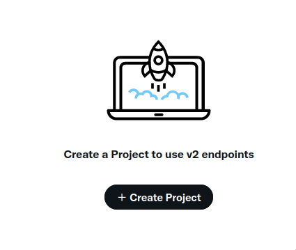
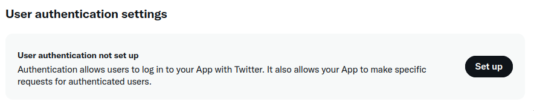
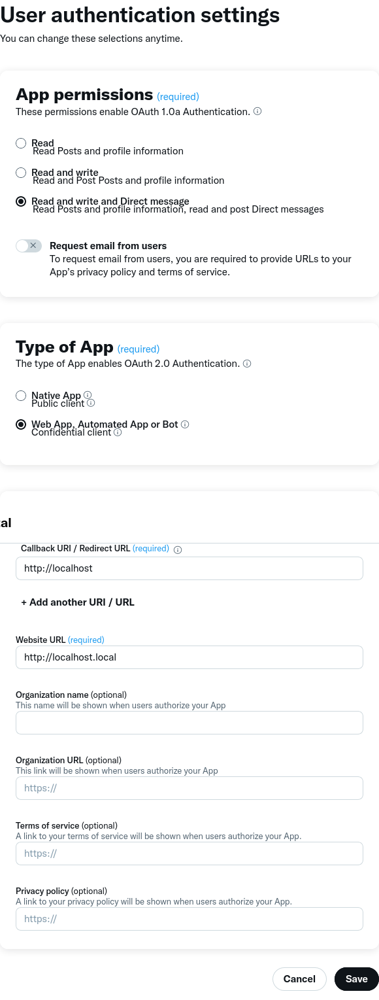

# Tutorial: Tweets mithilfe des `delete-tweets` Python Packages löschen

Ich zeige wie man einige der Anforderungen erfüllt

### Anforderungen:

- Ein Twitter-Entwicklerkonto, um API-Zugang zu erhalten
- Ein Benutzerdatenarchiv von Twitter
- Python und pip, um das Tool auszuführen


Dieses Tutorial wird folgende Schritte beschreiben:
1. Ein Twitter-Entwickler Konto erstellen und eine Applikation registrieren
2. Ein Datenarchiv von Twitter anfordern und downloaden
3. Über pip das `delete-tweets` Paket installieren
4. Mit `delete-tweets` und dem Datenarchiv alte Tweets systematisch löschen


## Schritt 1: Entwickler Konto erstellen und Applikation registrieren
- Gehe zur [Twitter-Entwickler Webseite](https://developer.twitter.com/en/account/).
- Melde dich an falls nötig
- Folge den Anweisungen und wähle die kostenlose Option bei der Preisstufen-Auswahl
- Hier ein [Guide](https://www.jcchouinard.com/apply-for-a-twitter-developer-account/) für den gesamten Prozess
- Wenn du alles abgeschlossen hast, kannst du nun auf das Entwickler Portal zugreifen
- Navigiere auf der Navigationsleiste zu `Dashboard`


- Erstelle ein neues Projekt



- Erteile dem Projekt einen Namen, wähle einen Use-Case (z.B. "Exploring the API") und erstelle eine kurze Projekt beschreibung
- Du wirst automatisch dazu aufgefordert eine App zu erstellen, gebe ihr einen einzigartigen unbenutzten Namen (bspw. dein Username + "delete-tweet")
- Du siehst nun 3 wichtige Informationen:
    - API Key
    - API Key Secret
    - Bearer Token
- **!WICHTIG!** Speichere sie alle sicher ab, sodass du sie auch unterscheiden kannst

- Nun kannst du auf die App Details zugreifen
- Setzte "User authentication" auf



- Fülle nun das Formular aus
- Wähle hierbei mindestens "Read and write" Berechtigungen aus
- Wähle WebApp
- Du kannst Müll Adressen in die Pflichtfelder füllen



- Speichern

- Du siehst nun eine Client ID und ein Client Secret
- **!WICHTIG!** Speichere sie alle sicher ab, sodass du sie auch unterscheiden kannst


## Schritt 2: Datenarchiv anfordern
- In der Twitter App: gehe auf "Einstellungen und Support"
- Wähle "Einstellungen und Datenschutz"
- Gehe auf "Dein Account"
- Nun wähle "Ein Archiv deiner Daten herunterladen"
- Folge dem Prozess und fordere ein Archiv an
- In der Regel ist das Archiv nach einem Tag bereit
- Sobald es bereit ist, navigiere wieder an die selbe Stelle und lade das Archiv herunter

## Schritt 3: Über pip das `delete-tweets` Tool herunterladen

Führe folgenden Befehl in der Shell aus

```bash
pip install delete-tweets
```

## Schritt 4: Tweets löschen

Erstelle folgenden Umgebungsvariablen und weise ihnen entsprechende Werte zu:

- TWITTER_CONSUMER_KEY = API Key
- TWITTER_CONSUMER_SECRET = API Key Secret
- TWITTER_ACCESS_TOKEN = Client ID
- TWITTER_ACCESS_TOKEN_SECRET = Client Secret

Das Datenarchiv beinhaltet 
- eine Datei 'Your Archive.html'
- zwei Verzeichnisse 'data' und 'assets'

Im Verzeichnis 'data' findest du eine Datei namens 'tweet.js'.

Entpacke das Archiv und kopiere ihren Pfad.

Um nun alle tweets zu löschen führe folgenden Befehl aus:

```bash
delete-tweets --until 2018-01-01 path/to/tweet.js
```

Passe das Datum an deine Bedürfnisse an und ersetze 'path/to/tweet.js' mit dem Pfad zur tweet.js

Genaueres gibt es im [Github von delete-tweets](https://github.com/koenrh/delete-tweets)